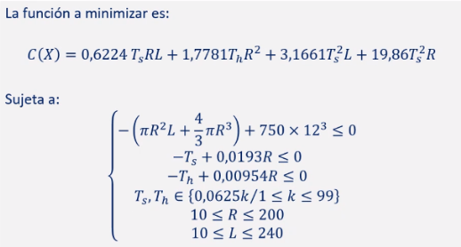

# mono-objective-optimization
Different ways of solving a problem, given a specific objective function and some constraints, using Matlab.

## Tareas 

* Formular matemáticamente el problema como un problema de optimización con restricciones.

* Utilizar un método determinista para su resolución. Probar con distintos puntos de inicio (al menos 3) y comprobar, en todos los casos, si se cumplen todas las restricciones. Incorporar los resultados obtenidos al informe (variables (redondear a 4 cifras decimales), valor de la función objetivo y restricciones), indicando el punto de inicio y las opciones de OPTIMSET/OPTIMOPTIONS que has utilizado.

* Resolver el problema usando el GA Binario facilitado en clase. Indicar los parámetros utilizados.

* Resolver el problema usando la función ga() de Matlab con representación real. Utilizar como criterio de parada de parada de la optimización el número máximo de generaciones.

* Ejecutar 30 veces el algoritmo con los parámetros que mejor se adaptan al problema, con N = 200 y G = 500 (función ga() de Matlab) y con N = 200 y G = 5000 (GA Binario).

* En todos los casos hay que añadir al informe la parte de los códigos que se ha modificado y las tablas creadas en el ajuste de parámetros. Son tres tablas: Best, Mean, Standard Deviation.

* Interpretar y analizar los resultados obtenidos.

## Ecuaciones

## Pruebas

