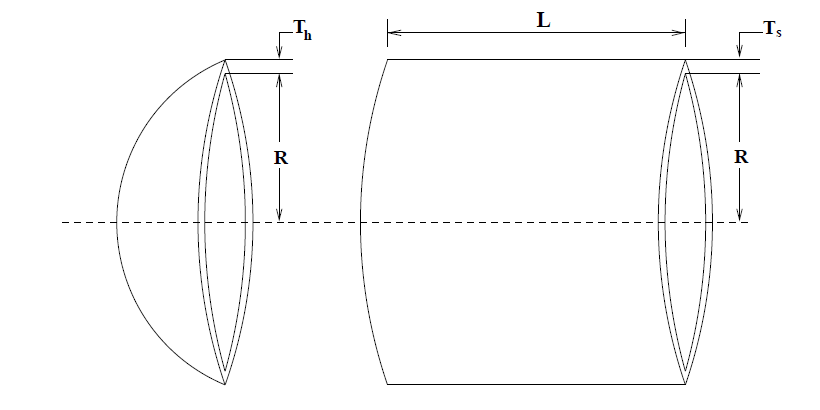
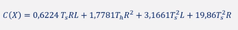
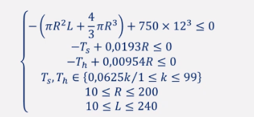

# mono-objective-optimization
Different ways of solving a problem, given a specific objective function and some constraints, using Matlab.

## Problem 

You want to build a cylindrical pressure vessel covered on both sides with hemispherical heads. The objective is to minimize the total cost, including the cost of the material, shape and weld.

The air storage tank must withstand a working pressure of 3000 psi and must have a minimum volume of 750 ft3.

## Numerical Modeling

### Objective Function

### Constraints

## Solutions

We rely on three different approaches:

* Using deterministic optimization, as it is a minimization problem with restrictions, we use the function **fmincon()** from the matlab library.

* Using heuristic and evolutionary optimization with genetic algorithms with real representation of individuals, using the **ga()** function from the matlab library.

* Using heuristic and evolutionary optimization with genetic algorithms with binary representation of individuals, using an algorithm proposed by the [SIANI university institute](https://www.siani.es/).
